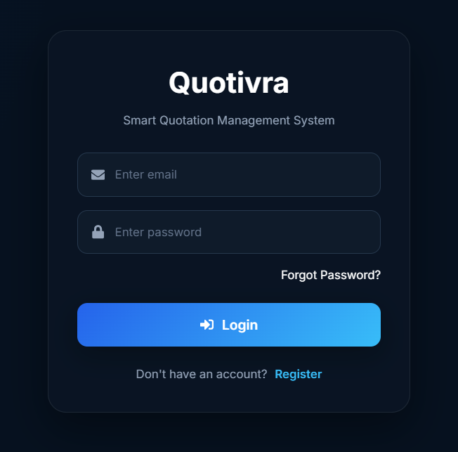
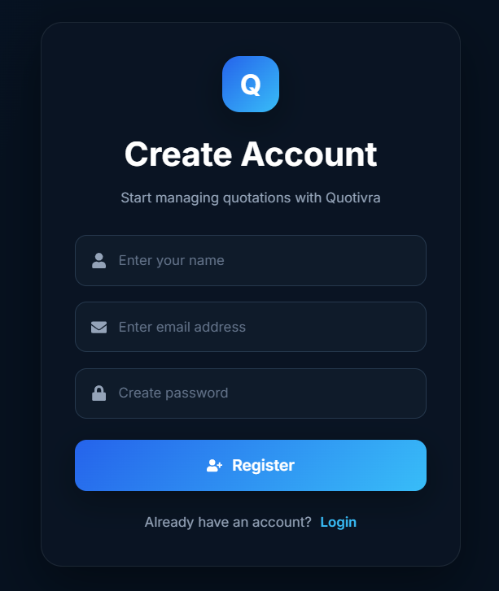
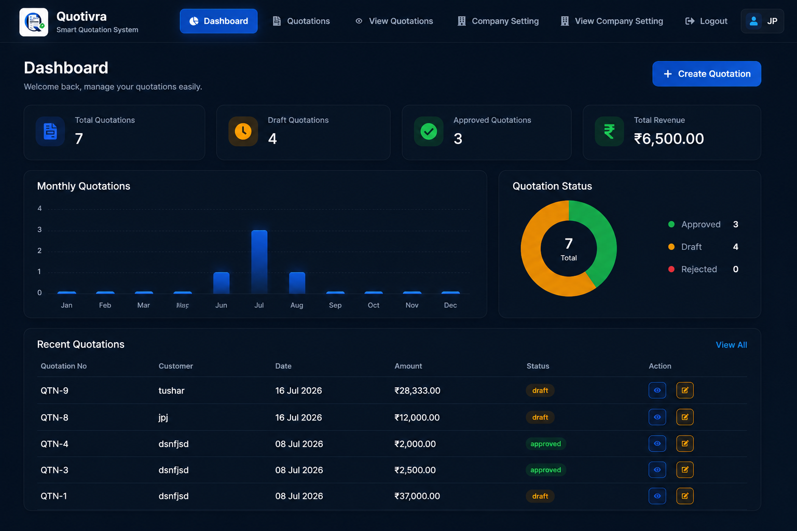
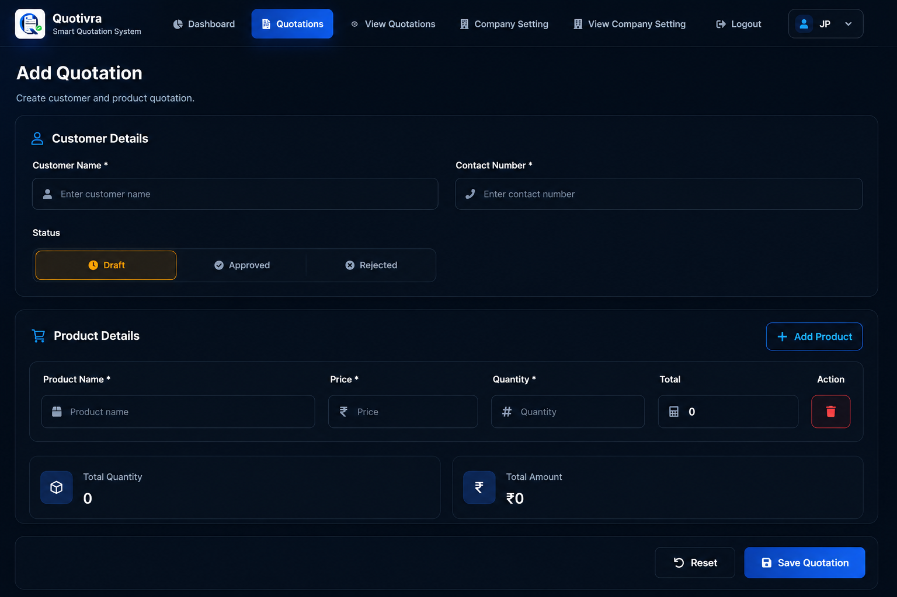
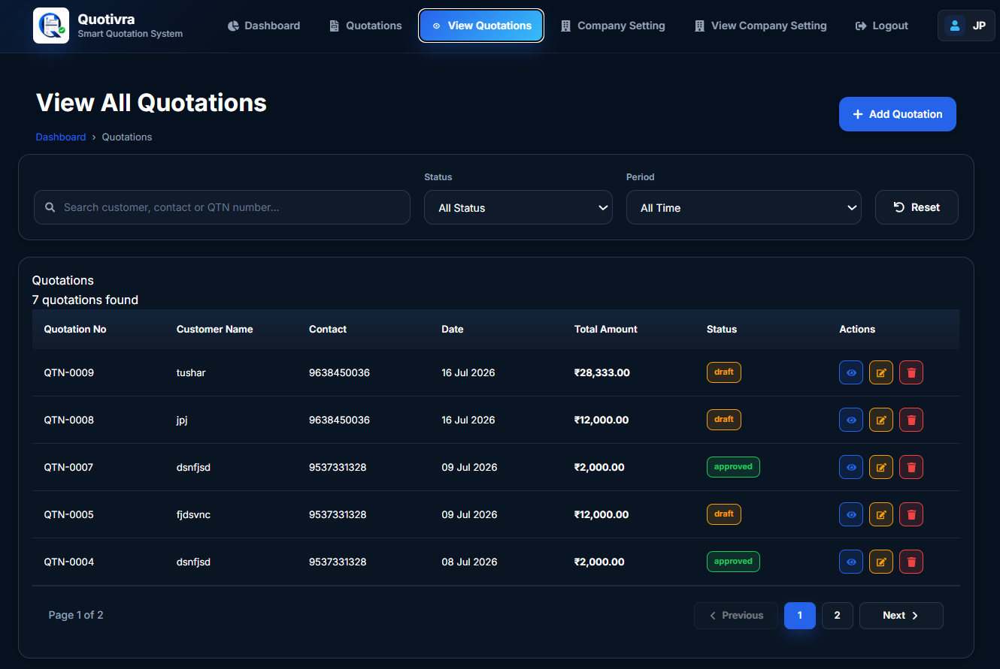
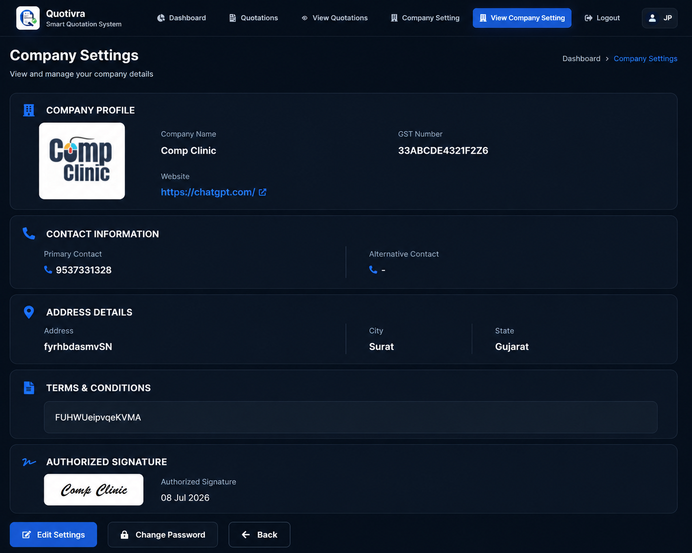
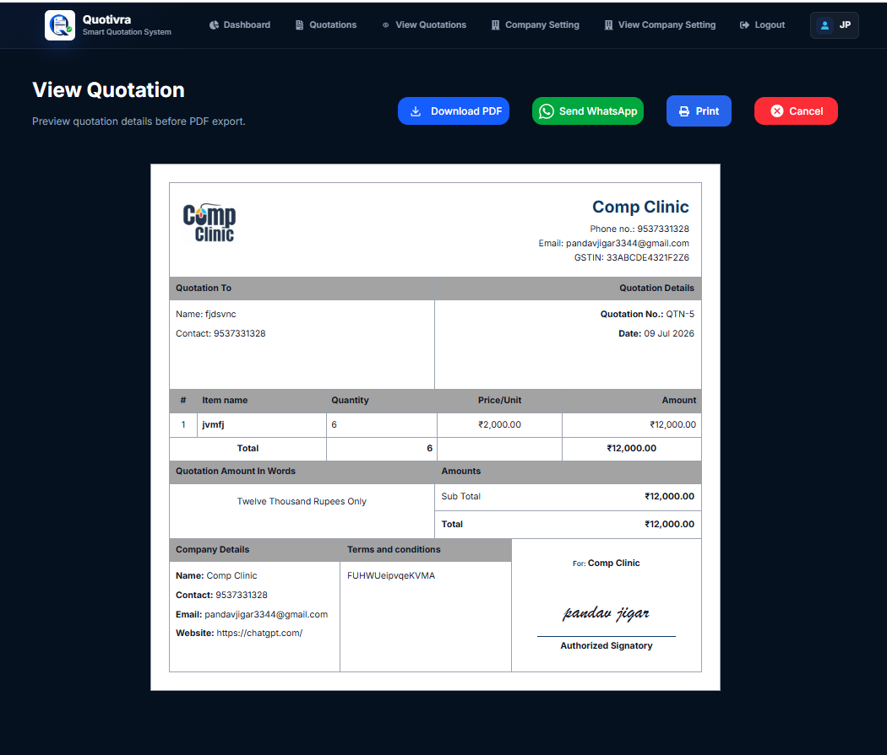
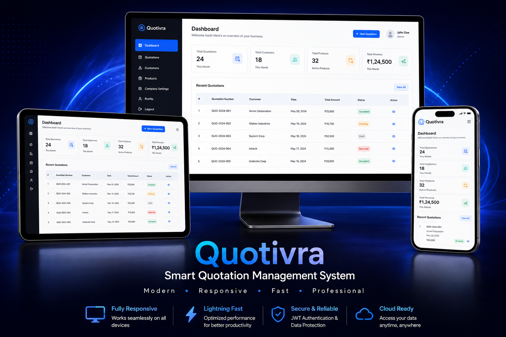

#  Quotivra

## Smart Quotation Management System

Professional, lightweight MERN documentation for a web-based quotation management system where administrators can create, manage, download, and share business quotations.

[Frontend Docs](./frontend/README.md) |
[Backend Docs](./backend/README.md) |
[Main Docs](./README.md) | 
[Live Demo](https://quotivra.vercel.app/) | 
[API](https://quotivra.onrender.com) | 
[Repository](https://github.com/jigarpandav/Quotivra)


---

## Table of Contents

- [Project Overview](#project-overview)
- [Key Features](#key-features)
- [Technologies Used](#technologies-used)
- [System Architecture](#system-architecture)
- [Application Workflow](#application-workflow)
- [Project Structure](#project-structure)
- [Frontend Features](#frontend-features)
- [Backend Features](#backend-features)
- [Authentication Flow](#authentication-flow)
- [Quotation Creation Workflow](#quotation-creation-workflow)
- [Database Design Overview](#database-design-overview)
- [REST API Overview](#rest-api-overview)
- [Installation Guide](#installation-guide)
- [Environment Variables](#environment-variables)
- [Running the Project](#running-the-project)
- [Screenshots](#screenshots)
- [Future Improvements](#future-improvements)
- [Contributing](#contributing)
- [License](#license)
- [Author](#author)
- [Contact Information](#contact-information)

---

## Project Overview

Quotivra is a modern quotation management application for administrators who need a simple way to prepare professional quotations without maintaining separate customer, product, brand, or category modules.

The workflow is intentionally direct: customer details and product details are entered inside each quotation. This keeps the system fast for small teams, service providers, freelancers, and businesses that want quotation creation without heavy master-data management.

The React and Vite frontend provides the user interface, protected pages, forms, quotation views, and sharing actions. The Express backend exposes REST endpoints for authentication, company settings, dashboard data, and quotation operations. MongoDB stores administrator, company, quotation, and quotation-item documents through Mongoose models.

---

## Key Features

### Authentication

- Administrator registration
- Administrator login
- JWT-based session token generation
- Password encryption with bcrypt-compatible hashing
- Protected frontend routes
- Password reset and password change support

### Dashboard

- Total quotations
- Draft quotations
- Approved quotations
- Rejected quotations
- Recent quotations

### Company Settings

- Company logo
- Company name and profile details
- Address and contact information
- Terms and conditions
- Authorized signature
- GST information when applicable

### Quotation Management

- Create, view, update, and delete quotations
- Dynamic product rows inside the quotation form
- Customer details entered per quotation
- Product information entered per quotation
- Automatic item-total calculation
- Automatic quantity and grand-total calculation
- Quotation status management: draft, approved, rejected

### PDF Generation

- Professional quotation PDF support
- Company information
- Customer information
- Quotation item table
- Total quantity and grand total
- Terms and conditions
- Signature

### WhatsApp Sharing

- Share quotation details through WhatsApp
- Share a quotation link or generated document when supported by the current implementation

> Quotivra does not include separate customer, product, brand, or category management modules.

---

## Technologies Used

### Frontend

| Category | Technology |
| --- | --- |
| UI Library | React.js |
| Build Tool | Vite |
| HTTP Client | Axios |
| Routing | React Router |
| Styling | CSS3 |
| Icons | React Icons |

### Backend

| Category | Technology |
| --- | --- |
| Runtime | Node.js |
| Framework | Express.js |
| Database | MongoDB |
| ODM | Mongoose |
| Authentication | JWT |
| Password Security | bcrypt-compatible hashing |
| Configuration | dotenv |
| Cross-Origin Access | cors |
| API Style | REST API |

---

## System Architecture

                         👨‍💼 Administrator
                                  │
                                  ▼
        ┌──────────────────────────────────────────────┐
        │              Frontend Layer                  │
        │                                              │
        │        ⚛️ React + Vite                       │
        │               │                              │
        │               ▼                              │
        │ Dashboard • Company Settings • Quotations   │
        └──────────────────┬───────────────────────────┘
                           │
                    Axios API Requests
                           │
                           ▼
        ┌──────────────────────────────────────────────┐
        │               Backend Layer                  │
        │                                              │
        │         🚀 Express REST API                  │
        │                  │                           │
        │                  ▼                           │
        │ 🛡️ JWT • CORS • Validation                  │
        │                  │                           │
        │                  ▼                           │
        │ 🎯 Controllers / Business Logic             │
        │        ├──────────────┬──────────────┐       │
        │        ▼              ▼              ▼       │
        │   📦 Models      📄 PDF         💬 WhatsApp │
        └────────┬─────────────────────────────────────┘
                 │
                 ▼
        ┌──────────────────────────────┐
        │        Database Layer        │
        │                              │
        │     🍃 MongoDB Atlas         │
        └──────────────────────────────┘

---

## Application Workflow

                🚀 Start
                    │
                    ▼
            🔐 Login / Register
                    │
                    ▼
              📊 Dashboard
             ┌──────┴──────┐
             │             │
             ▼             ▼
   🏢 Company Setup    📝 Create Quotation
             │             │
             ▼             ▼
      💾 Save Info    👤 Customer Details
                            │
                            ▼
                    📦 Add Products
                            │
                            ▼
                 🧮 Calculate Total
                            │
                            ▼
                    💾 Save Quotation
                            │
                            ▼
                   📋 Manage Quotations
        ┌──────────┼──────────┬──────────┬──────────┐
        ▼          ▼          ▼          ▼          ▼
     👁️ View   ✏️ Edit   📄 PDF   🖨️ Print   💬 WhatsApp
        └──────────┴──────────┴──────────┴──────────┘
                            │
                            ▼
                      ✅ Complete

---

## Project Structure

```text
Quotivra/
|
+-- frontend/
|   +-- public/
|   +-- src/
|   |   +-- assets/
|   |   +-- components/
|   |   +-- pages/
|   |   +-- routes/
|   |   +-- utils/
|   +-- package.json
|   +-- vite.config.js
|
+-- backend/
|   +-- config/
|   +-- controller/
|   +-- models/
|   +-- router/
|   +-- uploads/
|   +-- package.json
|   +-- index.js
|
+-- screenshots/
|   +-- README.md
|
+-- README.md
```

| Folder | Role |
| --- | --- |
| `frontend/` | React and Vite client application |
| `frontend/src/pages/` | Authentication, dashboard, company, and quotation screens |
| `frontend/src/components/` | Shared UI components such as navigation, loaders, and protected routes |
| `frontend/src/routes/` | Client-side route definitions |
| `backend/` | Node.js and Express REST API |
| `backend/config/` | Database, file upload, mail, and token helpers |
| `backend/controller/` | API request handlers and business logic |
| `backend/models/` | Mongoose schemas and models |
| `backend/router/` | Express route declarations |
| `screenshots/` | Recruiter-friendly visual project gallery |

---

## Frontend Features

- Authentication pages for login, registration, password reset, and password change
- Protected routes for dashboard, company settings, and quotation pages
- Dashboard summary cards and recent quotation information
- Company settings forms and views
- Quotation form with dynamic item rows
- Quotation list, view, update, and invoice screens
- PDF preview and download support
- WhatsApp sharing workflow
- Responsive UI for desktop and mobile screens

Read more in the [frontend documentation](./frontend/README.md).

---

## Backend Features

- REST API built with Express.js
- Administrator registration and login
- JWT token generation during login
- Password hashing and password recovery support
- Company settings create, read, and update operations
- Quotation CRUD operations
- MongoDB integration through Mongoose
- PDF generation support
- WhatsApp sharing support through frontend share flows
- Validation and consistent error responses

Read more in the [backend documentation](./backend/README.md).

---

## Authentication Flow

                      🚀 Start
                          │
                          ▼
              📝 Administrator Registration
                          │
                          ▼
         ✅ Validate Input (Name • Email • Password)
                          │
                          ▼
               🔒 Hash Password (bcrypt)
                          │
                          ▼
               💾 Store Administrator
                    (MongoDB)
                          │
                          ▼
                 🔑 Administrator Login
                          │
                          ▼
             🛡️ Verify Email & Password
                          │
                          ▼
               ┌─────────────────────┐
               │ Credentials Valid?  │
               └───────┬─────────────┘
                   Yes │         │ No
                       ▼         ▼
            🎫 Generate JWT   ❌ Authentication Failed
                       │              │
                       ▼              ▼
         📦 Return JWT & Admin Data  🔁 Retry Login
                       │              │
                       ▼              └──────────────┐
          💾 Store Token (Local Storage)            │
                       │                            │
                       ▼                            │
               🔐 Protected Routes ◄───────────────┘
                       │
                       ▼
                📊 Dashboard Access
                       │
                       ▼
      📄 Company Settings
      📝 Quotations
      📑 PDF Export
      💬 WhatsApp Share
                       │
                       ▼
                ✅ Authenticated

The backend generates a JWT after successful login. The exact client-side storage method should be verified from the frontend implementation before documenting it as local storage, session storage, or cookies.

---

## Quotation Creation Workflow

1. Administrator logs in.
2. Administrator opens the quotation form.
3. Customer details are entered directly inside the quotation.
4. Product rows are added dynamically.
5. Price, quantity, and item totals are calculated.
6. Total quantity and grand total are calculated.
7. Quotation is saved with a status.
8. Quotation can be viewed, updated, deleted, downloaded, or shared.

---

## Database Design Overview

| Collection | Purpose | Relationship |
| --- | --- | --- |
| `admins` | Stores administrator authentication and recovery information | One administrator can own company settings, quotations, and quotation items |
| `company_settings` | Stores company profile and quotation branding information | Linked to an administrator |
| `quotations` | Stores quotation-level customer, amount, date, and status information | One quotation can contain multiple items |
| `quotation_items` | Stores individual quotation products, quantity, price, and total | Belongs to one quotation |

                            ┌──────────────────────────┐
                            │         ADMINS          │
                            ├──────────────────────────┤
                            │ PK  _id                 │
                            │ name                    │
                            │ email                   │
                            │ password                │
                            └──────────┬──────────────┘
                                       │
                          manages (1:1)│
                                       ▼
                 ┌───────────────────────────────────────┐
                 │         COMPANY_SETTINGS              │
                 ├───────────────────────────────────────┤
                 │ PK  _id                              │
                 │ FK  admin_id                         │
                 │ company_name                         │
                 │ company_logo                         │
                 │ address                              │
                 │ city                                 │
                 │ state                                │
                 │ contact                              │
                 │ website                              │
                 │ gst                                  │
                 └───────────────────────────────────────┘


                                       │
                          creates (1:N)│
                                       ▼
                 ┌───────────────────────────────────────┐
                 │           QUOTATIONS                 │
                 ├───────────────────────────────────────┤
                 │ PK  _id                              │
                 │ FK  admin_id                         │
                 │ quotation_no                         │
                 │ customer_name                        │
                 │ customer_contact                     │
                 │ quotation_date                       │
                 │ status                               │
                 │ total_quantity                       │
                 │ total_amount                         │
                 └───────────────┬───────────────────────┘
                                 │
                     contains (1:N)
                                 ▼
                 ┌───────────────────────────────────────┐
                 │         QUOTATION_ITEMS              │
                 ├───────────────────────────────────────┤
                 │ PK  _id                              │
                 │ FK  quotation_id                     │
                 │ FK  admin_id                         │
                 │ product_name                         │
                 │ price                                │
                 │ quantity                             │
                 │ total                                │
                 └───────────────────────────────────────┘

MongoDB is a document database. This ER diagram represents logical references between documents through MongoDB ObjectIds, not SQL-style relational tables.

---

## REST API Overview

### Authentication

| Method | Endpoint | Description | Access |
| --- | --- | --- | --- |
| POST | `/api/admin/register` | Register an administrator | Public |
| POST | `/api/admin/login` | Authenticate an administrator | Public |
| POST | `/api/admin` | Retrieve administrator details | Application |
| POST | `/api/admin/forgot-password` | Request password reset | Public |
| POST | `/api/admin/reset-password/:token` | Reset password | Public |
| POST | `/api/admin/change-password` | Change password | Application |

### Company Settings

| Method | Endpoint | Description | Access |
| --- | --- | --- | --- |
| POST | `/api/company-setting` | Create company settings | Application |
| POST | `/api/company-settings` | Retrieve company settings | Application |
| PUT | `/api/company-settings/update` | Update company settings | Application |

### Quotations

| Method | Endpoint | Description | Access |
| --- | --- | --- | --- |
| POST | `/api/quotation` | Create a quotation | Application |
| POST | `/api/quotations` | Retrieve quotations | Application |
| POST | `/api/quotation/id` | Retrieve one quotation | Application |
| PUT | `/api/quotation/update` | Update a quotation | Application |
| POST | `/api/quotation/delete` | Delete a quotation | Application |

### Dashboard

| Method | Endpoint | Description | Access |
| --- | --- | --- | --- |
| POST | `/api/dashboard` | Retrieve dashboard summary data | Application |

Actual endpoint behavior and access control should always match the route files and middleware implementation.

---

## Installation Guide

```bash
git clone <repository-url>
cd Quotivra
```

### Backend Setup

```bash
cd backend
npm install
```

### Frontend Setup

```bash
cd ../frontend
npm install
```

---

## Environment Variables

### Backend `.env`

```env
PORT=5000
MONGO_URL=<your-mongodb-connection-string>
JWT_SECRET=<your-secure-jwt-secret>
```

| Variable | Required | Purpose | Example |
| --- | --- | --- | --- |
| `PORT` | No | API server port | `5000` |
| `MONGO_URL` | Yes | MongoDB connection string | `mongodb+srv://...` |
| `JWT_SECRET` | Yes | Secret key used to sign JWTs | `replace-with-secure-secret` |

### Frontend `.env`

```env
VITE_API_URL=http://localhost:5000/api
```

| Variable | Required | Purpose | Example |
| --- | --- | --- | --- |
| `VITE_API_URL` | Yes | Base API URL used by the frontend | `http://localhost:5000/api` |

> Security reminders: never commit `.env` files, never expose `JWT_SECRET`, never publish the MongoDB connection string, and do not place private secrets in Vite environment variables.

---

## Running the Project

### Start Backend

```bash
cd backend
npm run dev
```

### Start Frontend

```bash
cd frontend
npm run dev
```

Confirm exact scripts from each `package.json` before deploying or sharing setup instructions.

---

## Screenshots










---

## Future Improvements

- Quotation search
- Pagination
- Status filters
- Dashboard charts
- Email sharing
- Dark and light themes
- Reusable quotation templates
- Activity logs
- Automated tests
- Swagger or OpenAPI documentation
- Cloud file storage
- Role-based access
- Notifications
- Docker support
- CI/CD pipeline

---

## Contributing

1. Fork the repository.
2. Create a feature branch.
3. Make focused changes.
4. Test the frontend and backend.
5. Commit with a clear message.
6. Push the branch.
7. Open a pull request.

---

## License


---

## Author

**Jigar Pandav**  
Frontend Developer / MERN Stack Developer

- GitHub: `https://github.com/jigarpandav`
- LinkedIn: `www.linkedin.com/in/jigar-pandav-a098bb298`
- Email: `jigarpandav342005@gmail.com`

---

## Contact Information

| Contact Type | Placeholder |
| --- | --- |
| Repository | `https://github.com/jigarpandav/Quotivra` |
| Frontend Live URL | `https://github.com/jigarpandav/Quotivra/tree/main/frontend` |
| Backend API URL | `https://github.com/jigarpandav/Quotivra/tree/main/backend` |
| Email | `jigarpandav342005@gmail.com` |

---

If this project helped you understand the implementation, consider starring the repository.

**Quotivra: simple quotation management for faster business communication.**

[Back to top](#smart-quotation-management-system)
