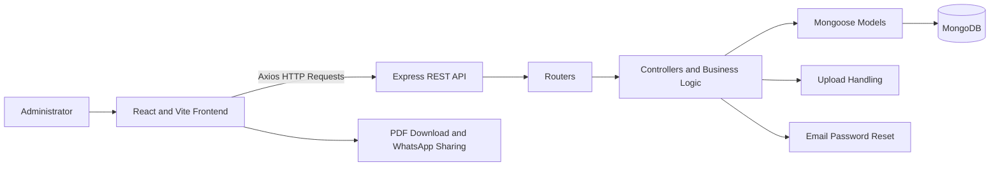
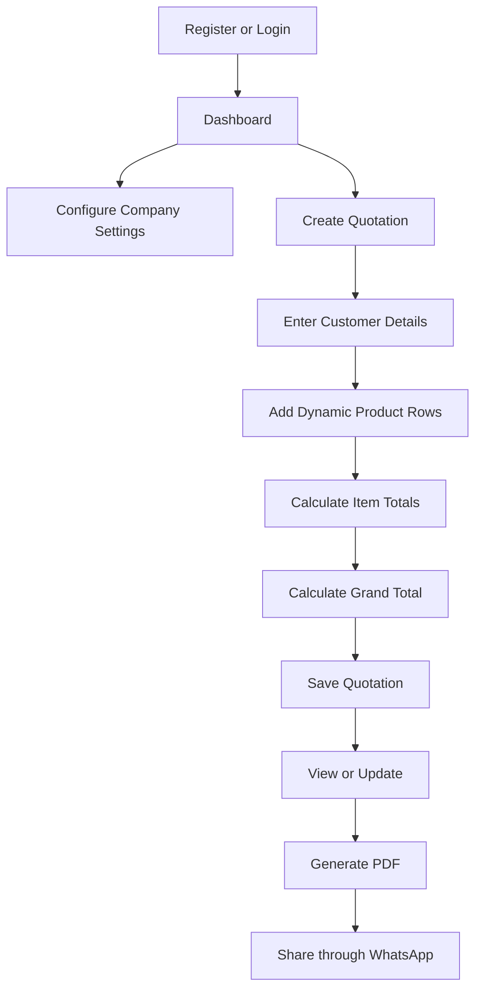
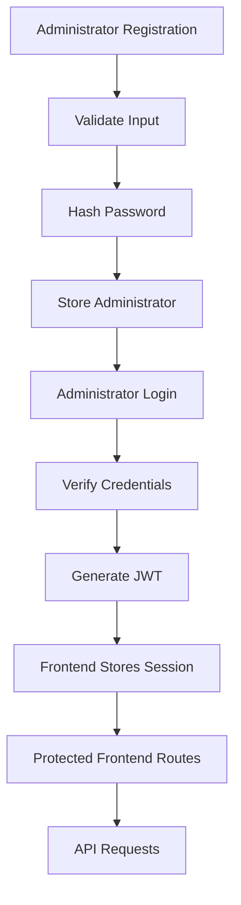
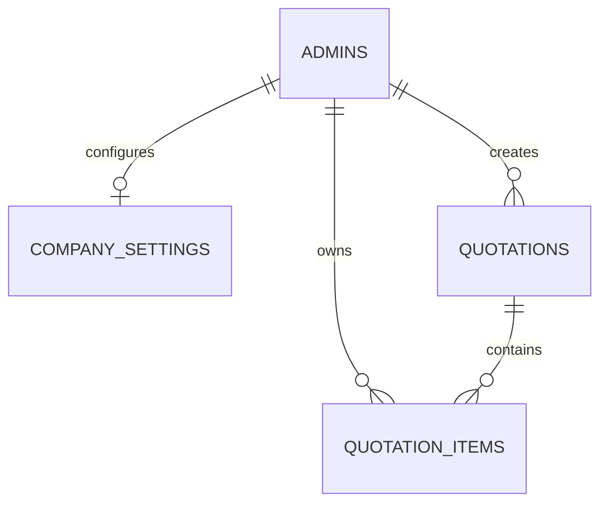

# Quotivra - Smart Quotation Management System


> A lightweight MERN quotation management system for creating, managing, downloading, and sharing professional business quotations.

Quotivra helps administrators manage the complete quotation workflow from one place: authentication, company settings, quotation creation, dynamic product rows, PDF download, dashboard tracking, and WhatsApp sharing support.

**Repository:** `<repository-url>`  
**Frontend Live URL:** `<frontend-live-url>`  
**Backend API URL:** `<backend-api-url>`

[Frontend Documentation](./frontend/README.md) | [Backend Documentation](./backend/README.md) | [Screenshots Guide](./screenshots/README.md)

[](https://react.dev/)
[](https://vite.dev/)
[](https://nodejs.org/)
[](https://expressjs.com/)
[](https://www.mongodb.com/)
[](https://mongoosejs.com/)
[](https://jwt.io/)
[](#rest-api-overview)
[](#screenshots)
[](#license)

## Table of Contents

- [Project Overview](#project-overview)
- [Key Features](#key-features)
- [Technologies Used](#technologies-used)
- [System Architecture](#system-architecture)
- [Application Workflow](#application-workflow)
- [Project Structure](#project-structure)
- [Frontend Features](#frontend-features)
- [Backend Features](#backend-features)
- [Authentication Flow](#authentication-flow)
- [Quotation Creation Workflow](#quotation-creation-workflow)
- [Database Design Overview](#database-design-overview)
- [REST API Overview](#rest-api-overview)
- [Installation Guide](#installation-guide)
- [Environment Variables](#environment-variables)
- [Running the Project](#running-the-project)
- [Screenshots](#screenshots)
- [Deployment Notes](#deployment-notes)
- [Security Notes](#security-notes)
- [Troubleshooting](#troubleshooting)
- [Future Improvements](#future-improvements)
- [Contributing](#contributing)
- [License](#license)
- [Author](#author)
- [Contact Information](#contact-information)

## Project Overview

Quotivra is a modern web-based quotation management system designed for small businesses, freelancers, service providers, and professionals who need a simple way to create and manage quotations.

The project solves a practical business problem: quotation details are often scattered across messages, spreadsheets, and manual PDF templates. Quotivra brings the workflow into a single MERN application where an administrator can configure company details, enter customer information, add product rows, calculate totals, save quotations, download PDF output, and share the quotation through WhatsApp.

Quotivra intentionally keeps the workflow lightweight. Customer details and product information are entered directly inside each quotation. The application does not include separate customer, product, brand, or category management modules.

The React and Vite frontend provides the user interface. The Express backend exposes REST-style API routes. MongoDB stores administrators, company settings, quotations, and quotation items through Mongoose models.

## Key Features

### Authentication

- Administrator registration
- Administrator login
- JWT token generation during login
- Password encryption with `bcrypt`
- Protected frontend routes
- Forgot password, reset password, and change password flows

### Dashboard

- Total quotations
- Draft quotations
- Approved quotations
- Rejected quotations
- Recent quotations
- Revenue summaries from approved quotations

### Company Settings

- Company logo
- Company name and details
- Address and contact information
- Website
- Terms and conditions
- Authorized signature details
- GST information when applicable

### Quotation Management

- Create quotation
- View quotation
- Update draft quotation
- Delete quotation
- Dynamic product rows
- Customer details entered per quotation
- Product information entered per quotation
- Automatic item-total calculation
- Quotation total handling
- Quotation status management with `draft`, `approved`, and `rejected`

### PDF Generation

- Professional quotation PDF from the frontend invoice view
- Company information
- Customer information
- Quotation item table
- Total quantity
- Grand total
- Terms and conditions
- Authorized signatory area

### WhatsApp Sharing

- Share quotation information through WhatsApp from the frontend
- Share a public quotation link when configured
- No direct WhatsApp Business API integration is shown in the backend source

## Technologies Used

### Frontend

| Category | Technology |
| --- | --- |
| UI Library | React.js |
| Build Tool | Vite |
| HTTP Client | Axios |
| Routing | React Router |
| Styling | CSS3 |
| Icons | React Icons |

### Backend

| Category | Technology |
| --- | --- |
| Runtime | Node.js |
| Framework | Express.js |
| Database | MongoDB |
| ODM | Mongoose |
| Authentication | JWT |
| Password Security | bcrypt.js |
| Configuration | dotenv |
| Cross-Origin Access | cors |
| API Style | REST API |

## System Architecture



> The backend generates JWTs on login. Current router files do not show server-side JWT middleware applied to API routes, so backend authorization should be strengthened before production use.

## Application Workflow



## Project Structure

```text
Quotivra/
|
|-- frontend/
|   |-- public/
|   |-- src/
|   |-- package.json
|   |-- vite.config.js
|   `-- README.md
|
|-- backend/
|   |-- config/
|   |-- controller/
|   |-- models/
|   |-- router/
|   |-- package.json
|   |-- index.js
|   `-- README.md
|
|-- screenshots/
|   `-- README.md
|
`-- README.md
```

| Folder | Role |
| --- | --- |
| `frontend/` | React and Vite application for administrator workflows |
| `frontend/src/` | Components, pages, routes, utilities, assets, and styles |
| `backend/` | Node.js and Express API server |
| `backend/config/` | Database, email, token, and upload configuration |
| `backend/controller/` | Backend request handlers and business logic |
| `backend/models/` | Mongoose schemas for application data |
| `backend/router/` | Express route definitions mounted under `/api` |
| `screenshots/` | Recommended location for project screenshots used in GitHub documentation |

## Frontend Features

- Authentication pages for login, registration, forgot password, reset password, and change password
- Protected frontend routes for authenticated screens
- Dashboard for quotation summaries
- Company settings screens
- Quotation form with dynamic item rows
- Quotation list and view screens
- Update quotation screen
- PDF preview, print, and download
- WhatsApp sharing workflow
- Responsive UI for mobile, tablet, laptop, and desktop usage

See the dedicated [Frontend README](./frontend/README.md) for setup, routes, scripts, environment variables, and frontend-specific documentation.

## Backend Features

- REST-style API routes mounted under `/api`
- Administrator registration and login
- JWT generation
- Password hashing with `bcrypt`
- Password reset email support
- Company settings create, read, and update logic
- Quotation create, read, update, delete, search, filter, and pagination logic
- MongoDB integration through Mongoose
- Company logo upload support with Multer
- Validation and controller-level error handling

See the dedicated [Backend README](./backend/README.md) for API endpoint tables, environment variables, database notes, scripts, and backend-specific documentation.

## Authentication Flow



The frontend currently checks the token from browser storage for protected page access. The backend currently returns a JWT during login, but server-side JWT route middleware is not shown in the route files.

## Quotation Creation Workflow

1. Administrator logs in.
2. Administrator opens the quotation form.
3. Customer details are entered directly inside the quotation.
4. Product rows are added dynamically.
5. Price, quantity, and item totals are calculated.
6. Total quantity and grand total are calculated or handled by the frontend and backend workflow.
7. Quotation is saved with a status.
8. Quotation can be viewed, updated, deleted, downloaded as PDF, printed, or shared through WhatsApp.

## Database Design Overview

MongoDB stores application data as documents. The diagram below represents logical document references through MongoDB ObjectIds, not SQL tables.

| Collection | Purpose | Relationship |
| --- | --- | --- |
| `admins` | Stores administrator authentication and recovery information | One administrator can own company settings, quotations, and quotation items |
| `companysettings` | Stores company profile and quotation branding information | Linked to an administrator |
| `quotations` | Stores quotation-level customer, amount, date, and status information | One quotation can contain multiple items |
| `quotationitems` | Stores individual quotation products, quantity, price, and total | Belongs to one quotation |



## REST API Overview

Actual endpoint behavior and access control should match the backend route files and middleware implementation. Current backend routes receive administrator or resource IDs in request bodies for many operations; the route files do not currently apply JWT middleware.

### Authentication

| Method | Endpoint | Description | Access |
| --- | --- | --- | --- |
| `POST` | `/api/admin/register` | Register an administrator | Public |
| `POST` | `/api/admin/login` | Authenticate an administrator and return a JWT | Public |
| `POST` | `/api/admin` | Retrieve administrator details | Admin ID required |
| `POST` | `/api/admin/forgot-password` | Send password reset email | Public |
| `POST` | `/api/admin/reset-password/:token` | Reset password with token | Public token route |
| `POST` | `/api/admin/change-password` | Change password | Admin ID and old password required |

### Company Settings

| Method | Endpoint | Description | Access |
| --- | --- | --- | --- |
| `POST` | `/api/company-setting` | Create company settings | Admin ID required |
| `POST` | `/api/company-settings` | Retrieve company settings | Admin ID required |
| `PUT` | `/api/company-settings/update` | Update company settings | Admin ID and company ID required |

### Quotations

| Method | Endpoint | Description | Access |
| --- | --- | --- | --- |
| `POST` | `/api/quotation` | Create a quotation | Admin ID required |
| `POST` | `/api/quotations` | Retrieve all quotations with pagination and filters | Admin ID required |
| `POST` | `/api/quotation/id` | Retrieve one quotation | Quotation ID required |
| `PUT` | `/api/quotation/update` | Update a draft quotation | Admin ID and quotation ID required |
| `POST` | `/api/quotation/delete` | Delete a quotation | Quotation ID required |

### Dashboard

| Method | Endpoint | Description | Access |
| --- | --- | --- | --- |
| `POST` | `/api/dashboard` | Retrieve dashboard summary data | Admin ID required |

## Installation Guide

```bash
git clone <repository-url>
cd Quotivra
```

### Backend Setup

```bash
cd backend
npm install
```

### Frontend Setup

```bash
cd ../frontend
npm install
```

## Environment Variables

### Backend `.env`

Create `backend/.env`:

```env
PORT=5000
MONGO_URL=<your-mongodb-connection-string>
JWT_SECRET=<your-secure-jwt-secret>
EMAIL_USER=<your-email-address>
EMAIL_PASS=<your-email-app-password>
```

| Variable | Required | Purpose | Example |
| --- | --- | --- | --- |
| `PORT` | No | Backend server port | `5000` |
| `MONGO_URL` | Yes | MongoDB connection string | `mongodb://127.0.0.1:27017/quotivra` |
| `JWT_SECRET` | Yes | Secret for signing JWT login tokens | `<long-random-secret>` |
| `EMAIL_USER` | Required for password reset email | Email sender account | `<your-email-address>` |
| `EMAIL_PASS` | Required for password reset email | Email password or app password | `<email-app-password>` |

### Frontend `.env`

Create `frontend/.env`:

```env
VITE_API_URL=http://localhost:5000/api
VITE_LOGO_URL=http://localhost:5000
VITE_PUBLIC_SITE_URL=http://localhost:5173
```

| Variable | Required | Purpose | Example |
| --- | --- | --- | --- |
| `VITE_API_URL` | Yes | Backend API base URL | `http://localhost:5000/api` |
| `VITE_LOGO_URL` | Required for uploaded logo display | Base URL for uploaded company logo assets | `http://localhost:5000` |
| `VITE_PUBLIC_SITE_URL` | Required for production share links | Public frontend URL for quotation links | `https://your-frontend-domain.com` |

Security reminders:

- Never commit `.env` files.
- Never expose `JWT_SECRET`.
- Never publish the MongoDB connection string.
- Do not place private secrets in Vite environment variables because they are included in the client bundle.

## Running the Project

Start the backend:

```bash
cd backend
npm run dev
```

Start the frontend in a separate terminal:

```bash
cd frontend
npm run dev
```

Exact scripts should be confirmed from each `package.json`.

## Screenshots

Add screenshots to the `screenshots/` folder and update these placeholders when images are available.

| Screen | Preview |
| --- | --- |
| Login |  |
| Register |  |
| Dashboard |  |
| Create Quotation |  |
| View Quotation |  |
| Update Quotation |  |
| Company Settings |  |
| PDF Preview |  |
| WhatsApp Share |  |
| Mobile Responsive UI |  |

See the [Screenshots Guide](./screenshots/README.md) for naming, sizing, and privacy recommendations.

## Deployment Notes

1. Configure backend production environment variables.
2. Connect the backend to the production MongoDB database.
3. Configure frontend Vite environment variables.
4. Build the frontend with `npm run build`.
5. Start the backend with the production script from `backend/package.json`.
6. Configure frontend SPA fallback routing.
7. Configure backend CORS for the deployed frontend origin.
8. Verify uploaded file storage for company logos.
9. Test login, company settings, quotation creation, PDF download, and WhatsApp sharing.

## Security Notes

- Passwords are hashed with `bcrypt`.
- Login tokens are signed with `JWT_SECRET`.
- Backend `.env` values must stay private.
- Frontend `VITE_` variables are public in the browser bundle.
- Server-side JWT authorization middleware should be added to sensitive API routes before production use.
- Backend CORS should be restricted to trusted frontend origins in production.
- Avoid returning sensitive administrator data in API responses.

## Troubleshooting

| Issue | Suggested Fix |
| --- | --- |
| Frontend cannot reach backend | Confirm backend is running and `VITE_API_URL` points to `http://localhost:5000/api` or the deployed API |
| MongoDB connection fails | Check `MONGO_URL`, database status, network access, and Atlas IP allowlist settings |
| Login fails | Verify credentials, `JWT_SECRET`, and backend logs |
| Password reset email fails | Check `EMAIL_USER`, `EMAIL_PASS`, and email provider app-password settings |
| Company logo does not appear | Confirm `VITE_LOGO_URL`, `/uploads` serving, and upload file path |
| CORS error | Configure backend CORS for the frontend origin |
| Blank page after deployment | Configure SPA fallback to serve `index.html` |
| Environment changes do not apply | Restart the backend or frontend dev server after editing `.env` |

## Future Improvements

These are future ideas, not current feature claims:

- Strong server-side JWT middleware for protected API routes
- Quotation search improvements
- Pagination refinements
- Status filters
- Dashboard charts
- Email sharing
- Dark and light themes
- Reusable quotation templates
- Activity logs
- Automated tests
- Swagger or OpenAPI documentation
- Cloud file storage
- Role-based access
- Notifications
- Docker support
- CI/CD pipeline

## Contributing

1. Fork the repository.
2. Create a feature branch.
3. Make focused changes.
4. Test the frontend and backend.
5. Commit with a clear message.
6. Push the branch.
7. Open a pull request.

## License

This project is currently developed for educational and portfolio purposes. Add a `LICENSE` file before distributing it as an open-source project.

## Author

**JP**  
MERN Stack Developer

- GitHub: `<github-profile-url>`
- LinkedIn: `<linkedin-profile-url>`
- Portfolio: `<portfolio-url>`
- Email: `<email-address>`

## Contact Information

| Platform | Link |
| --- | --- |
| GitHub | `<github-profile-url>` |
| LinkedIn | `<linkedin-profile-url>` |
| Portfolio | `<portfolio-url>` |
| Email | `<email-address>` |

---

If Quotivra helps you understand or build better quotation workflows, consider starring the project.

Built with the MERN stack for simpler, faster, and more professional quotation management.

[Back to Top](#quotivra---smart-quotation-management-system)
