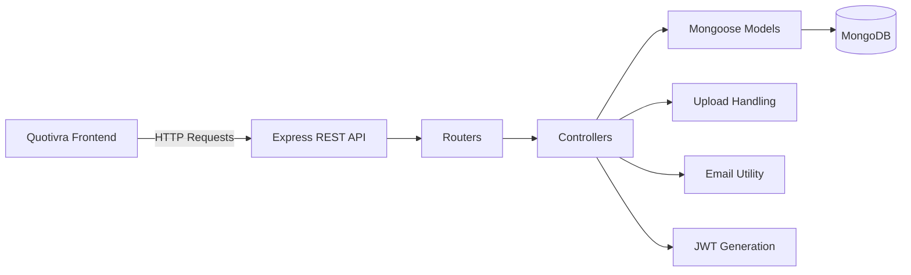
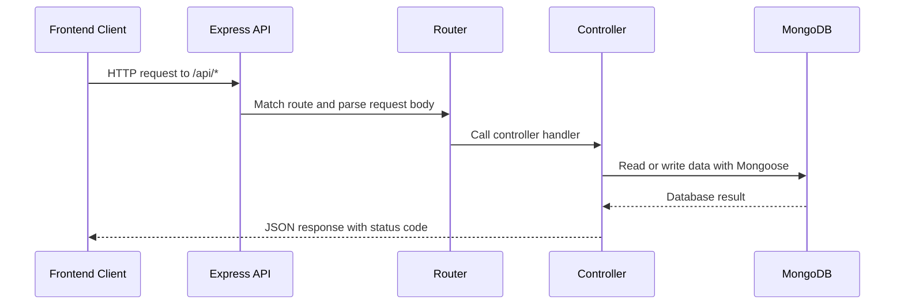
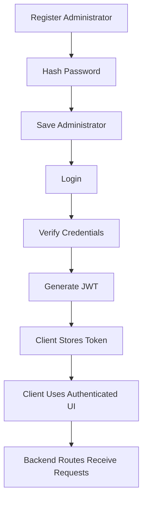

# Quotivra Backend

> REST API backend for secure, fast, and reliable quotation management.

Quotivra Backend is the server-side application for the Quotivra Smart Quotation Management System. It provides APIs for administrator authentication, password recovery, company settings, quotation management, dashboard data, image uploads, and quotation-related business logic consumed by the Quotivra frontend.

[](https://nodejs.org/)
[](https://expressjs.com/)
[](https://www.mongodb.com/)
[](https://mongoosejs.com/)
[](https://jwt.io/)
[](#api-documentation)

**Repository:** `<backend-repository-url>`  
**Production API:** `<production-api-url>`

## Table of Contents

- [Backend Overview](#backend-overview)
- [Key Features](#key-features)
- [System Architecture](#system-architecture)
- [Request Lifecycle](#request-lifecycle)
- [Technology Stack](#technology-stack)
- [Folder Structure](#folder-structure)
- [Database Design](#database-design)
- [API Documentation](#api-documentation)
- [Authentication Flow](#authentication-flow)
- [Prerequisites](#prerequisites)
- [Installation](#installation)
- [Environment Variables](#environment-variables)
- [Running the Backend](#running-the-backend)
- [Available Scripts](#available-scripts)
- [Example API Requests](#example-api-requests)
- [API Response Format](#api-response-format)
- [Error Handling](#error-handling)
- [Security](#security)
- [PDF Generation](#pdf-generation)
- [WhatsApp Support](#whatsapp-support)
- [Uploads Directory](#uploads-directory)
- [API Testing](#api-testing)
- [Deployment](#deployment)
- [Performance Considerations](#performance-considerations)
- [Troubleshooting](#troubleshooting)
- [Future Improvements](#future-improvements)
- [Contributing](#contributing)
- [Author](#author)
- [License](#license)

## Backend Overview

Quotivra Backend powers the data and business logic for the Quotivra frontend. It is built with Node.js, Express.js, MongoDB, and Mongoose, and exposes REST-style APIs under the `/api` path.

The backend handles administrator registration and login, password hashing, JWT generation, password reset email support, company profile data, quotation records, quotation items, dashboard summaries, and company logo uploads. The frontend communicates with these APIs through HTTP requests, usually by sending form data or JSON payloads.

Secure APIs are important for this system because quotations include administrator, customer, company, and pricing information. Authentication, validation, environment-variable hygiene, and careful error handling help protect that business data.

## Key Features

### Authentication

- Administrator registration
- Administrator login
- Password hashing with `bcrypt`
- JWT token generation during login
- Administrator lookup by ID
- Forgot password flow
- Reset password with generated token
- Change password with old-password verification

### Company Settings

- Create company settings
- Retrieve company settings by administrator
- Update company settings
- Upload company logo images with Multer
- Store company contact, GST, website, terms, and signature-related information

### Quotation Management

- Create quotations
- Store quotation items separately from quotation records
- Retrieve quotations by administrator
- Search, filter, and paginate quotation lists
- Retrieve a quotation by ID
- Update draft quotations
- Delete quotations and related quotation items
- Calculate quotation item totals from price and quantity

### Dashboard

- Total quotation counts
- Approved, draft, and rejected quotation counts
- Approved quotation revenue aggregation
- Monthly revenue aggregation
- Recent quotation data

### Email Support

- Password reset emails through Nodemailer
- Gmail transporter configuration through environment variables

### Uploads

- Company logo upload support
- Image file validation for JPG, JPEG, PNG, and WEBP
- File size limit of 5 MB
- Static serving of uploaded files from `/uploads`

## System Architecture



## Request Lifecycle



> Note: The current router files do not show JWT middleware applied to protected API routes. Login returns a JWT, and frontend routes use a token check, but server-side authorization middleware should be added before treating sensitive backend routes as fully protected.

## Technology Stack

| Category | Technology | Purpose |
| --- | --- | --- |
| Runtime | Node.js | Runs the backend JavaScript application |
| Framework | Express.js | Defines HTTP server, middleware, and API routes |
| Database | MongoDB | Stores administrators, company settings, quotations, and quotation items |
| ODM | Mongoose | Defines schemas and performs database operations |
| Authentication | JSON Web Token | Creates login tokens for authenticated sessions |
| Password Security | bcrypt | Hashes and verifies administrator passwords |
| Configuration | dotenv | Loads environment variables from `.env` |
| Cross-Origin Access | cors | Allows frontend-to-backend API communication |
| File Uploads | multer | Handles company logo uploads |
| Email | nodemailer | Sends password reset emails |
| PDF Library | pdfkit | Installed for PDF-related backend functionality |
| API Style | REST API | Organizes backend operations as HTTP endpoints |

## Folder Structure

```text
backend/
|
|-- config/
|   |-- db.js
|   |-- generateToken.js
|   |-- mail.js
|   `-- multer.js
|
|-- controller/
|   |-- authController.js
|   |-- companySettingController.js
|   |-- dashboardController.js
|   `-- quotationController.js
|
|-- models/
|   |-- Admin.js
|   |-- CompanySettings.js
|   |-- Quotation.js
|   `-- QuotationItems.js
|
|-- router/
|   |-- adminRouter.js
|   |-- companySettingRouter.js
|   |-- dashbaordRouter.js
|   `-- quotationRouter.js
|
|-- index.js
|-- package.json
`-- package-lock.json
```

| Path | Purpose |
| --- | --- |
| `config/db.js` | Connects the application to MongoDB using `MONGO_URL` |
| `config/generateToken.js` | Generates random password reset tokens |
| `config/mail.js` | Sends password reset emails with Nodemailer |
| `config/multer.js` | Configures disk storage, file type checks, and upload size limits |
| `controller/` | Contains request handlers and business logic |
| `models/` | Contains Mongoose schema definitions |
| `router/` | Defines Express route mappings |
| `index.js` | Creates the Express app, applies middleware, mounts routers, connects DB, and starts the server |
| `package.json` | Defines dependencies and npm scripts |

## Database Design

Exact schema definitions should be verified from the Mongoose model files in `models/`.

| Collection | Model | Purpose | Main Data |
| --- | --- | --- | --- |
| `admins` | `Admin` | Stores administrator accounts | Name, email, hashed password, password reset token data, timestamps |
| `companysettings` | `CompanySettings` | Stores business profile data for an administrator | Admin reference, company name, logo path, address, contact details, website, terms, signature, GST, timestamps |
| `quotations` | `Quotation` | Stores quotation-level customer and pricing data | Admin reference, quotation number, customer details, quotation date, total amount, status, timestamps |
| `quotationitems` | `QuotationItems` | Stores individual product rows for quotations | Admin reference, quotation reference, product name, price, quantity, total, timestamps |

Quotation items safely belong to quotations through the `quotation_id` reference. Quotations and company settings also reference the administrator through `admin_id`.

## API Documentation

All endpoints below are mounted from `index.js` under the `/api` prefix.

Access levels reflect the current route implementation. The current backend does not apply JWT middleware in the router files, so routes that receive `admin_id` are documented as **Admin ID required** instead of claiming full Bearer-token protection.

### Authentication Endpoints

| Method | Endpoint | Access | Description |
| --- | --- | --- | --- |
| `POST` | `/api/admin/register` | Public | Register a new administrator |
| `POST` | `/api/admin/login` | Public | Log in an administrator and return a JWT token |
| `POST` | `/api/admin` | Admin ID required | Retrieve administrator details |
| `POST` | `/api/admin/forgot-password` | Public | Send a password reset email |
| `POST` | `/api/admin/reset-password/:token` | Public token route | Reset password with a reset token |
| `POST` | `/api/admin/change-password` | Admin ID and old password required | Change an administrator password |

Generic login request example:

```json
{
  "email": "<admin-email>",
  "password": "<admin-password>"
}
```

### Company Settings Endpoints

| Method | Endpoint | Access | Description |
| --- | --- | --- | --- |
| `POST` | `/api/company-setting` | Admin ID required | Create company settings and optionally upload a company logo |
| `POST` | `/api/company-settings` | Admin ID required | Retrieve company settings for an administrator |
| `PUT` | `/api/company-settings/update` | Admin ID and company ID required | Update existing company settings |

Generic company settings request example:

```json
{
  "admin_id": "<admin-id>",
  "company_name": "<company-name>",
  "address": "<company-address>",
  "city": "<city>",
  "state": "<state>",
  "contact": "<contact-number>",
  "GST": "<gst-number>"
}
```

When uploading a company logo, send multipart form data with a `company_logo` file field.

### Quotation Endpoints

| Method | Endpoint | Access | Description |
| --- | --- | --- | --- |
| `POST` | `/api/quotation` | Admin ID required | Create a quotation and related quotation items |
| `PUT` | `/api/quotation/update` | Admin ID and quotation ID required | Update a draft quotation and replace its items |
| `POST` | `/api/quotations` | Admin ID required | Retrieve quotations with pagination, search, status filter, and period filter support |
| `POST` | `/api/quotation/id` | Quotation ID required | Retrieve one quotation and its quotation items |
| `POST` | `/api/quotation/delete` | Quotation ID required | Delete a quotation and its related quotation items |

Generic quotation request example:

```json
{
  "admin_id": "<admin-id>",
  "customer_name": "<customer-name>",
  "customer_contact": "<customer-contact>",
  "quotation_date": "<date>",
  "total_amount": "<total-amount>",
  "status": "draft",
  "products": [
    {
      "product_name": "<product-name>",
      "price": "<price>",
      "quantity": "<quantity>"
    }
  ]
}
```

Generic quotation-list request example:

```json
{
  "admin_id": "<admin-id>",
  "page": 1,
  "limit": 5,
  "search": "<optional-search-text>",
  "status": "<draft-approved-or-rejected>",
  "period": "<this-month-last-month-this-year-or-last-year>"
}
```

### Dashboard Endpoint

| Method | Endpoint | Access | Description |
| --- | --- | --- | --- |
| `POST` | `/api/dashboard` | Admin ID required | Retrieve quotation counts, revenue summaries, monthly revenue, and recent quotations |

## Authentication Flow



Login currently generates a JWT with the administrator ID and email, expiring in 7 days. Server-side JWT verification middleware is recommended before relying on the token for backend route protection.

### Authentication Header

Protected backend routes should use a Bearer token pattern when JWT middleware is added:

```http
Authorization: Bearer <token>
```

## Prerequisites

- Node.js
- npm
- MongoDB database or MongoDB Atlas connection
- Email account credentials for password reset email support

## Installation

```bash
git clone <backend-repository-url>
cd backend
npm install
```

These commands clone the backend repository, move into the backend directory, and install the dependencies listed in `package.json`.

## Environment Variables

Create a `.env` file inside the `backend/` directory:

```env
PORT=5000
MONGO_URL=<your-mongodb-connection-string>
JWT_SECRET=<your-secure-jwt-secret>
EMAIL_USER=<your-email-address>
EMAIL_PASS=<your-email-app-password>
```

| Variable | Required | Description | Example |
| --- | --- | --- | --- |
| `PORT` | No | Server port. Defaults to `5000` when not provided. | `5000` |
| `MONGO_URL` | Yes | MongoDB connection string used by Mongoose. | `mongodb://127.0.0.1:27017/quotivra` |
| `JWT_SECRET` | Yes | Secret used to sign login JWT tokens. | `<long-random-secret>` |
| `EMAIL_USER` | Required for forgot-password emails | Email account used by Nodemailer. | `<your-email-address>` |
| `EMAIL_PASS` | Required for forgot-password emails | Email password or app password used by Nodemailer. | `<email-app-password>` |

Security reminders:

- Never commit `.env` files.
- Use a long, random JWT secret.
- Do not expose the MongoDB connection string publicly.
- Use an app password or provider-approved credential for email sending.

## Running the Backend

Start the development server:

```bash
npm run dev
```

Start the server with Node:

```bash
npm start
```

Available scripts must always be verified from `package.json`.

## Available Scripts

| Script | Command | Purpose |
| --- | --- | --- |
| `npm run dev` | `nodemon index.js` | Starts the backend in development mode with automatic restarts |
| `npm start` | `node index.js` | Starts the backend with Node.js |

## Example API Requests

Login example:

```bash
curl -X POST http://localhost:5000/api/admin/login \
  -H "Content-Type: application/json" \
  -d '{
    "email": "<admin-email>",
    "password": "<admin-password>"
  }'
```

Quotation list example:

```bash
curl -X POST http://localhost:5000/api/quotations \
  -H "Content-Type: application/json" \
  -d '{
    "admin_id": "<admin-id>",
    "page": 1,
    "limit": 5
  }'
```

Future Bearer-token protected request pattern:

```bash
curl http://localhost:5000/api/quotations \
  -H "Authorization: Bearer <token>"
```

Actual required request fields must match the backend controller and model validation.

## API Response Format

The backend returns JSON responses with appropriate HTTP status codes. Exact response fields vary by controller.

Common status-code categories used or expected by the API:

| Status | Meaning |
| --- | --- |
| `200` | Successful request |
| `201` | Successful creation |
| `400` | Invalid or missing request data |
| `401` | Authentication or password verification failure |
| `404` | Resource not found |
| `409` | Conflict, such as duplicate email or existing company settings |
| `500` | Internal server error |
| `502` | Email provider rejected a reset email |

## Error Handling

The controllers currently handle common errors directly with `try/catch` blocks and JSON responses.

Error-handling responsibilities include:

- Missing required fields
- Invalid MongoDB Object IDs
- Duplicate administrator email
- Existing company settings conflict
- Invalid login credentials
- Invalid or expired password reset token
- Missing company settings or quotations
- Database errors
- Email provider failures
- Internal server errors

Centralized Express error middleware is not currently shown in the repository.

## Security

Confirmed security-related behavior:

- Passwords are hashed with `bcrypt`.
- Login generates a JWT signed with `JWT_SECRET`.
- Password reset tokens are generated with `crypto.randomBytes`.
- MongoDB schema validation is used for several fields.
- CORS is enabled for frontend communication.
- Uploaded company logos are restricted to JPG, JPEG, PNG, and WEBP.
- Upload size is limited to 5 MB.
- Sensitive configuration is loaded from environment variables.

Recommended security improvements:

- Add JWT verification middleware to sensitive API routes.
- Validate authorization server-side instead of relying only on `admin_id` in request bodies.
- Restrict CORS to trusted frontend origins in production.
- Avoid returning sensitive fields such as password hashes in admin responses.
- Add safe, consistent error responses.
- Add rate limiting for authentication endpoints.
- Add security headers with middleware such as Helmet.

## PDF Generation

`pdfkit` is installed and imported in the quotation controller, but the current router does not expose a dedicated backend PDF generation endpoint. The frontend currently handles quotation PDF download with `html2pdf.js`.

When backend PDF generation is implemented or exposed, a quotation PDF should include:

- Company details
- Customer details
- Quotation items
- Quantity
- Price
- Totals
- Terms and conditions
- Authorized signature when available

## WhatsApp Support

The backend stores and returns quotation data that the frontend can use for WhatsApp sharing. The current source does not show direct WhatsApp Business API integration or direct message sending from the backend.

Current support is best described as:

- Providing quotation data for shareable messages
- Supporting customer contact data in quotation records
- Allowing the frontend to create quotation share links

## Uploads Directory

The backend serves uploaded files from `/uploads` and stores company logo files in an `uploads/` directory through Multer. If the directory is not present locally, create it before testing company logo uploads.

The exact file-storage strategy should be reviewed before production deployment, especially if the server filesystem is temporary or multiple instances are used.

## API Testing

You can test the API with:

- Postman
- Insomnia
- `curl`

No automated test files are currently present in the backend folder. Add tests before relying on the API for production workflows.

## Deployment

Platform-neutral deployment checklist:

1. Configure production environment variables.
2. Connect the production MongoDB database.
3. Install dependencies.
4. Start the Node.js server using the configured production command.
5. Configure allowed frontend origins in CORS.
6. Verify uploaded file storage for company logos.
7. Test authentication, password reset, company settings, dashboard, and quotation routes.
8. Use HTTPS in production.
9. Confirm frontend `VITE_API_URL` points to the deployed backend API.

## Performance Considerations

Recommended considerations:

- Keep MongoDB queries efficient.
- Continue using pagination for quotation lists.
- Add database indexes for frequently searched fields where needed.
- Avoid transferring unnecessary data to the frontend.
- Clean temporary or unused upload files.
- Handle asynchronous errors consistently.
- Review aggregation performance for dashboard metrics as data volume grows.

## Troubleshooting

| Issue | Possible Fix |
| --- | --- |
| MongoDB connection failure | Check `MONGO_URL`, database availability, network access, and MongoDB Atlas IP allowlist settings |
| Invalid JWT token | Confirm `JWT_SECRET` is configured and the token has not expired |
| Missing environment variables | Create `backend/.env` and restart the server |
| CORS errors | Configure CORS for the deployed frontend origin |
| Port already in use | Change `PORT` in `.env` or stop the process using the current port |
| Frontend unable to reach API | Verify the backend is running and frontend `VITE_API_URL` points to `/api` |
| Company logo upload fails | Confirm `uploads/` exists, file type is supported, and file size is under 5 MB |
| Forgot password email fails | Check `EMAIL_USER`, `EMAIL_PASS`, and email provider app-password settings |
| PDF generation failure | Verify whether PDF generation is handled by the frontend or an implemented backend route |
| WhatsApp share link not opening | Check frontend share-link generation and customer contact data |
| Development server not starting | Run `npm install`, verify `.env`, and inspect terminal errors |

## Future Improvements

These are roadmap ideas, not current feature claims:

- Server-side JWT authorization middleware
- API pagination improvements
- Advanced search and filtering
- Swagger or OpenAPI documentation
- Automated unit and integration testing
- Rate limiting
- Helmet security headers
- Refresh tokens
- Role-based authorization
- Activity logging
- Email quotation sharing
- Backend PDF generation endpoint
- Cloud storage for uploaded logos and generated PDFs
- Docker support
- CI/CD pipeline

## Contributing

1. Fork the repository.
2. Create a feature branch.
3. Make focused changes.
4. Test the API.
5. Commit with a clear message.
6. Push the branch.
7. Open a pull request.

## Author

**JP**  
Backend Developer / MERN Stack Developer

- GitHub: `<github-profile-url>`
- LinkedIn: `<linkedin-profile-url>`
- Portfolio: `<portfolio-url>`
- Email: `<email-address>`

## License

This project is currently intended for educational and portfolio purposes unless a repository license file specifies otherwise. Do not assume a license until one is included in the project.

---

Built with Node.js, Express.js, and MongoDB to make quotation management secure, fast, and reliable. If this project helps you, consider starring the repository.
