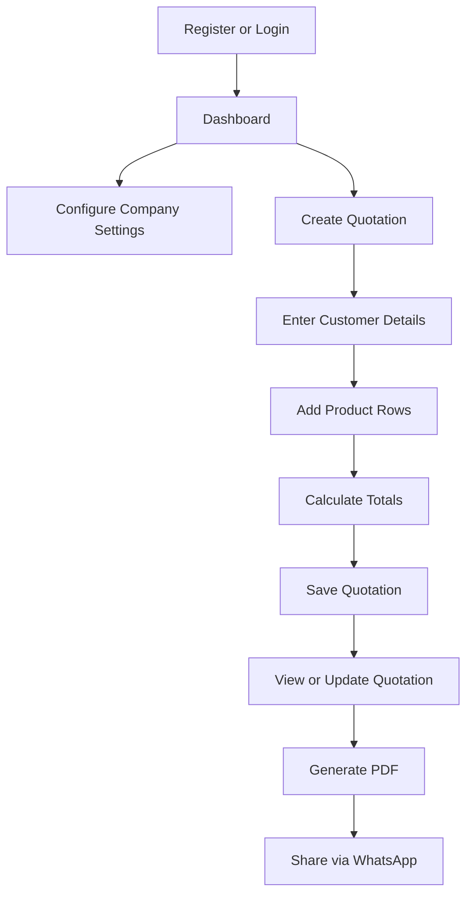
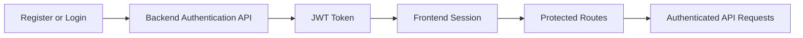

# Quotivra - Frontend

> Smart quotation management UI built with React and Vite for faster, simpler, and more professional quotation workflows.

Quotivra is the frontend application for a Smart Quotation Management System. It helps administrators register, log in, configure company details, create and manage quotations, generate PDF quotations, and share quotation links through WhatsApp.

**Frontend Application**

[](https://react.dev/)
[](https://vite.dev/)
[](https://reactrouter.com/)
[](https://axios-http.com/)
[](#responsive-design)

**Repository:** `<frontend-repository-url>`  
**Live Demo:** `<live-demo-url>`

## Table of Contents

- [Project Overview](#project-overview)
- [Key Features](#key-features)
- [Application Workflow](#application-workflow)
- [Technology Stack](#technology-stack)
- [Folder Structure](#folder-structure)
- [Pages and Routes](#pages-and-routes)
- [Prerequisites](#prerequisites)
- [Installation](#installation)
- [Environment Variables](#environment-variables)
- [Running the Application](#running-the-application)
- [Production Build](#production-build)
- [Available Scripts](#available-scripts)
- [Backend Integration](#backend-integration)
- [Authentication Flow](#authentication-flow)
- [PDF and WhatsApp Workflow](#pdf-and-whatsapp-workflow)
- [Responsive Design](#responsive-design)
- [Screenshots](#screenshots)
- [Deployment](#deployment)
- [Security Considerations](#security-considerations)
- [Troubleshooting](#troubleshooting)
- [Future Improvements](#future-improvements)
- [Contributing](#contributing)
- [Author](#author)
- [License](#license)

## Project Overview

Quotivra - Frontend is a React and Vite application for managing business quotations through a clean, responsive administrator interface. It is designed for small businesses, freelancers, service providers, and professionals who need a simple way to prepare, review, export, and share quotations.

The frontend communicates with the backend API through Axios. Backend configuration is handled through Vite environment variables, with `VITE_API_URL` used as the API base URL. The interface focuses on speed and simplicity so administrators can move quickly from customer entry to quotation creation, PDF generation, and sharing.

## Key Features

### Authentication

- Administrator registration
- Administrator login
- JWT-based authentication with backend API
- Protected frontend routes
- Local session checks for authenticated pages
- Forgot password, reset password, and change password screens

### Dashboard

- Responsive dashboard interface
- Quotation summary area
- Quick navigation to quotation-related actions

### Quotation Management

- Create quotations
- View quotation details
- Update quotations
- Delete quotations
- Add multiple product rows dynamically
- Automatic item-total calculation
- Automatic quotation-total calculation

### Customer and Product Entry

- Customer information entered directly in quotation forms
- Product name, price, and quantity entry
- Item totals and grand total calculation
- Mobile-friendly quotation item display

### Company Settings

- Manage company information used in quotations
- Configure business details for PDF output
- Display company details, logo, contact information, website, GST, terms, and authorized signatory data where available

### PDF Generation

- Generate professional quotation PDFs
- Display company information
- Display customer information
- Display quotation items
- Display pricing totals
- Display terms and authorized signatory area
- Print quotation view from the browser

### WhatsApp Integration

- Share quotation information through WhatsApp
- Send quotation number, quotation amount, and public quotation link
- Uses the configured public frontend URL when available

### Responsive Design

- Mobile-responsive user interface
- Tablet-friendly layout
- Desktop-friendly layout
- Consistent quotation preview experience across screen sizes

## Application Workflow



## Technology Stack

| Category | Technology | Purpose |
| --- | --- | --- |
| UI Library | React.js | Builds the component-based frontend interface |
| Build Tool | Vite | Provides fast development and optimized production builds |
| Routing | React Router DOM | Handles public, protected, and dynamic application routes |
| HTTP Client | Axios | Sends requests to the backend API |
| Styling | CSS3 | Styles pages, components, responsive layouts, and quotation views |
| Icons | React Icons | Provides icons for navigation, actions, PDF, print, and WhatsApp controls |
| Authentication | JWT integration with backend API | Protects admin-only frontend workflows |
| PDF Export | html2pdf.js | Generates downloadable quotation PDF files |
| Notifications | React Toastify | Displays user-facing success and error messages |
| Number Formatting | to-words | Converts quotation amounts into words |

## Folder Structure

```text
frontend/
|
|-- public/
|-- src/
|   |-- assets/
|   |-- components/
|   |-- pages/
|   |-- routes/
|   |-- utils/
|   |-- axios.js
|   |-- App.jsx
|   |-- main.jsx
|   `-- index.css
|
|-- package.json
|-- vite.config.js
`-- vercel.json
```

| Path | Description |
| --- | --- |
| `public/` | Static files served directly by Vite |
| `src/assets/` | Images and shared global style files |
| `src/components/` | Reusable UI components such as navbar, loader, modal, and protected route wrapper |
| `src/pages/` | Page-level views for authentication, dashboard, company settings, and quotations |
| `src/routes/` | Central React Router route definitions |
| `src/utils/` | Shared helpers for date, currency, and number-to-word formatting |
| `src/axios.js` | Configured Axios client for backend API calls |
| `vite.config.js` | Vite configuration |
| `vercel.json` | SPA fallback rewrite configuration for Vercel-style deployments |

## Pages and Routes

| Page | Route | Purpose | Access |
| --- | --- | --- | --- |
| Login | `/` | Administrator login | Public |
| Register | `/register` | Administrator registration | Public |
| Forgot Password | `/forgot-password` | Request password reset | Public |
| Reset Password | `/reset-password/:token` | Reset password with token | Public |
| Change Password | `/change-password` | Change administrator password | Public in route file; expects admin context |
| Dashboard | `/dashboard` | View dashboard and quotation summary area | Protected |
| Company Settings | `/company-setting` | Add or manage company details | Protected |
| View Company Settings | `/company-setting/view` | Review saved company details | Protected |
| Update Company Settings | `/company-settings/:id` | Edit company details | Protected |
| Create Quotation | `/quotations/add` | Create a new quotation | Protected |
| Quotation Form | `/quotations` | Quotation form page | Protected |
| Edit Quotation | `/quotations/edit/:id` | Edit quotation from the quotation form page | Protected |
| Update Quotation | `/update-Quotation/:id` | Update an existing quotation | Protected |
| View Quotations | `/quotations/view` | List or view saved quotations | Protected |
| Quotation Invoice | `/quotations/invoice/:id` | Preview, print, download, and share quotation | Protected |
| Public Quotation Invoice | `/send-quotation-invoice/:id` | Shared quotation invoice view | Public |

## Prerequisites

- Node.js
- npm

Use the versions supported by the current `package.json` dependencies and your local Vite setup.

## Installation

```bash
git clone <frontend-repository-url>
cd frontend
npm install
```

If this frontend is inside the full Quotivra repository, move into the frontend directory before installing dependencies:

```bash
cd frontend
npm install
```

## Environment Variables

Create a `.env` file inside the `frontend/` directory:

```env
VITE_API_URL=http://localhost:5000/api
VITE_LOGO_URL=http://localhost:5000
VITE_PUBLIC_SITE_URL=http://localhost:5173
```

Vite only exposes client-side environment variables that begin with `VITE_`.

| Variable | Required | Description | Example |
| --- | --- | --- | --- |
| `VITE_API_URL` | Yes | Backend API base URL used by Axios | `http://localhost:5000/api` |
| `VITE_LOGO_URL` | Required for uploaded logo display | Base URL used to load company logo assets | `http://localhost:5000` |
| `VITE_PUBLIC_SITE_URL` | Required for production WhatsApp sharing links | Public frontend URL used to create shared quotation links | `https://your-frontend-domain.com` |

Do not place private secrets in frontend environment variables. Vite variables are included in the client bundle.

## Running the Application

```bash
npm run dev
```

After starting the dev server, use the local URL shown in the Vite terminal output. Do not assume the port if Vite chooses a different one.

## Production Build

Create an optimized production build:

```bash
npm run build
```

Preview the production build locally:

```bash
npm run preview
```

`npm run build` generates the production files in `dist/`. `npm run preview` serves the built output locally for final verification.

## Available Scripts

The actual `package.json` is the source of truth for scripts.

| Script | Purpose |
| --- | --- |
| `npm run dev` | Starts the Vite development server |
| `npm run build` | Creates an optimized production build |
| `npm run preview` | Serves the production build locally |
| `npm run lint` | Runs ESLint checks across the frontend codebase |

## Backend Integration

The frontend communicates with the backend through the shared Axios client in `src/axios.js`. The base API URL comes from `VITE_API_URL`, with a local fallback of `http://localhost:5000/api`.

Backend-backed workflows include:

- Authentication requests for login, registration, password reset, and password changes
- Quotation create, read, update, and delete requests
- Company settings create, read, and update requests
- Dashboard data requests
- Admin profile and company details needed for quotation PDFs
- Loading states, toast messages, and API error handling in user-facing flows

Endpoint details should be maintained in the application code and backend documentation instead of duplicated manually in this README.

## Authentication Flow



The current protected route check reads the authentication token from `localStorage`. If no token is found, protected pages redirect to the login page.

## PDF and WhatsApp Workflow

Quotation data is collected through the quotation form, saved through the backend API, and later loaded into the invoice view. The invoice view combines quotation details, quotation items, company settings, and administrator data to render a printable quotation.

PDF export is handled with `html2pdf.js`. The app clones the quotation section, prepares a PDF-friendly layout, and downloads the generated file. WhatsApp sharing opens a `wa.me` link containing the customer-facing quotation message and a public quotation URL generated from `VITE_PUBLIC_SITE_URL` or the current site origin.

## Responsive Design

| Screen Size | Experience |
| --- | --- |
| Mobile | Forms and quotation details should remain readable, actions should be easy to tap, and quotation items should adapt into compact mobile cards |
| Tablet | Layouts should balance navigation, form entry, and quotation review without crowding controls |
| Laptop | Dashboard, quotation management, and invoice preview should support efficient repeated use |
| Desktop | Wider layouts should make scanning quotation data, company settings, and invoice details comfortable |

## Screenshots

Update these paths after adding screenshots to the project.

| Screen | Preview |
| --- | --- |
| Login |  |
| Register |  |
| Dashboard |  |
| Company Settings |  |
| Create Quotation |  |
| View Quotation |  |
| PDF Preview |  |
| Mobile View |  |

## Deployment

General Vite deployment checklist:

1. Configure production environment variables, especially `VITE_API_URL`, `VITE_LOGO_URL`, and `VITE_PUBLIC_SITE_URL`.
2. Create the production build:

```bash
npm run build
```

3. Upload the generated `dist/` directory or connect the frontend repository to your hosting provider.
4. Configure SPA route fallback so direct visits to React Router routes load `index.html`.
5. Verify backend CORS allows requests from the deployed frontend domain.
6. Test login, protected routes, company settings, quotation creation, PDF download, and WhatsApp sharing after deployment.

The included `vercel.json` contains an SPA rewrite to `index.html` for deployments that support that configuration format.

## Security Considerations

- Protect frontend routes that require authentication.
- Keep JWT validation and authorization enforcement on the backend.
- Avoid exposing secrets in `VITE_` environment variables.
- Remember that frontend environment variables are bundled into client-side code.
- Validate form input on the client for usability and on the backend for security.
- Handle API errors clearly without exposing sensitive server details.
- Configure backend CORS for trusted frontend origins.
- Keep dependencies updated and review security advisories regularly.

## Troubleshooting

| Issue | Possible Fix |
| --- | --- |
| Frontend cannot connect to backend | Confirm the backend server is running and `VITE_API_URL` points to the correct API base URL |
| Incorrect API URL | Update `.env`, then restart the Vite development server |
| CORS errors | Allow the frontend origin in the backend CORS configuration |
| Blank page after deployment | Confirm SPA fallback is configured and the built `dist/` files were deployed correctly |
| Protected routes redirect unexpectedly | Check whether the login response stores a valid token and whether the browser has cleared local storage |
| Environment changes are not applying | Restart `npm run dev` after editing `.env` |
| Company logo does not appear | Confirm `VITE_LOGO_URL` points to the backend or asset host serving uploaded logo files |
| PDF download does not work | Verify the invoice section renders before export and check browser console errors |
| WhatsApp sharing does not work | Confirm the customer contact number exists and `VITE_PUBLIC_SITE_URL` is configured for deployed sharing links |

## Future Improvements

These are roadmap ideas, not current feature claims:

- Advanced quotation search
- Filters and pagination
- Dashboard charts
- Dark and light themes
- Improved accessibility
- Email quotation sharing
- Reusable quotation templates
- Offline draft support
- Automated frontend testing
- Stronger protected-route handling for password and shared invoice pages

## Contributing

1. Fork the repository.
2. Create a feature branch.
3. Make your changes.
4. Test the application.
5. Commit your changes.
6. Push the branch.
7. Open a pull request.

## Author

**JP**  
Frontend Developer / MERN Stack Developer

- GitHub: `<github-profile-url>`
- LinkedIn: `<linkedin-profile-url>`
- Portfolio: `<portfolio-url>`
- Email: `<email-address>`

## License

Add or update the license section based on the repository's actual license file. Do not assume a license until one is included in the project.

---

Built with React and Vite for faster and simpler quotation management. If this project helps you, consider starring the repository.
